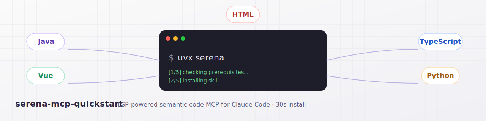

# serena-mcp-quickstart

<p align="center">
  
</p>

> One-shot installer that wires [Serena](https://github.com/oraios/serena) — the LSP-powered semantic code MCP server — into any Claude Code project in **under 30 seconds**.

Default preset enables LSPs for **Java · Vue · TypeScript (covers JS/React/TSX) · Python · HTML**, with one-line opt-ins for Go, Rust, C#, Kotlin, C/C++, Ruby, PHP, Swift, SCSS/CSS, and 20+ more.

---

## Install

### Option A — bash one-liner (fastest)

**Claude Code** (default):

```bash
curl -fsSL https://raw.githubusercontent.com/cskwork/serena-mcp-quickstart/main/install.sh | bash
```

**Codex CLI** (also registers in `~/.codex/config.toml`):

```bash
curl -fsSL https://raw.githubusercontent.com/cskwork/serena-mcp-quickstart/main/install.sh | bash -s -- --codex
```

**Codex CLI only** (skip Claude Code paths entirely):

```bash
curl -fsSL https://raw.githubusercontent.com/cskwork/serena-mcp-quickstart/main/install.sh | bash -s -- --codex-only
```

Run from your project root. The installer will:

1. Install [`uv`](https://astral.sh/uv) if missing.
2. Drop the Skill into `~/.claude/skills/serena-mcp-quickstart/` (skipped with `--codex-only`).
3. Register the Serena MCP server:
   - default → `.mcp.json` (project) or `~/.claude/mcp.json` (with `--global`)
   - `--codex` → also runs `codex mcp add serena ...` to register in `~/.codex/config.toml`
   - `--codex-only` → only the Codex registration
4. Generate `.serena/project.yml` pre-filled with the 5-language preset.
5. Append a `## Tooling` section to your project's `CLAUDE.md` and/or `AGENTS.md` so future agents prefer Serena over grep. With `--codex` / `--codex-only`, also appends to your global `~/.codex/AGENTS.md`.

Idempotent — safe to re-run. Existing configs are merged, never overwritten. Existing Tooling blocks are detected via `<!-- BEGIN serena-mcp-quickstart -->` markers and skipped.

### Option B — copy-paste prompt (zero CLI required)

Paste the block below into your CLI of choice (Claude Code, Codex, Gemini CLI). The agent figures out which host it's running on and registers Serena in the right place.

```
Install Serena MCP for this project using https://github.com/cskwork/serena-mcp-quickstart.

Steps:
1. Verify uvx is installed; if not, install uv via the official script.
2. Register the Serena MCP server. Detect which host you are running on and use the matching path:
   - Claude Code: append to .mcp.json (or ~/.claude/mcp.json for global) under mcpServers:
     {"mcpServers":{"serena":{"command":"uvx","args":["--from","git+https://github.com/oraios/serena","serena","start-mcp-server"]}}}
   - Codex CLI: run shell command  codex mcp add serena -- uvx --from git+https://github.com/oraios/serena serena start-mcp-server
   - Gemini CLI: append the equivalent block to its MCP config (refer to Gemini CLI docs).
3. Detect source files in the project. Map extensions to Serena enum values:
   .java→java  .vue→vue  .ts/.tsx/.js/.jsx→typescript  .py→python  .html→html
   (.css/.scss→scss  .go→go  .rs→rust  .cs→csharp  .kt→kotlin  .cpp/.c→cpp  etc.)
   NEVER use js/javascript/react/jsx/tsx/css as enum values — they are not valid.
4. Write .serena/project.yml with project_name=<repo dir name> and languages=<detected list>.
5. Append this block to CLAUDE.md (Claude Code) and/or AGENTS.md (Codex/Gemini CLI) — append to whichever exists in the project; create the file matching the active host if neither does. Skip if a BEGIN serena-mcp-quickstart marker is already present:
   <!-- BEGIN serena-mcp-quickstart -->
   ## Tooling

   - When `mcp__serena__*` tools are loaded, prefer them for code search and symbol-level edits over `Grep`/`Read`/`Edit`. Fall back silently if absent.
   <!-- END serena-mcp-quickstart -->
6. Tell me to restart the CLI, then run mcp__serena__check_onboarding_performed to verify.
```

---

## What you get

After install, every Claude Code or Codex CLI session in this project gains:

- `mcp__serena__find_symbol` — jump to a definition by name across services
- `mcp__serena__find_referencing_symbols` — true LSP references, not grep
- `mcp__serena__rename_symbol` — refactor across files safely
- `mcp__serena__replace_symbol_body` / `insert_after_symbol` — symbol-level edits
- `mcp__serena__get_symbols_overview` — file/class/function tree on demand
- 30+ more — see [tools list](https://oraios.github.io/serena/01-about/035_tools.html)

These are **dramatically more accurate than grep + read** in any non-trivial codebase, especially monorepos.

---

## Supported languages

| Group | Enum values |
|-------|-------------|
| Default preset | `java`, `vue`, `typescript`, `python`, `html` |
| Web (opt-in) | `scss` (CSS/SCSS/Sass), `angular` |
| Backend (opt-in) | `go`, `rust`, `csharp`, `kotlin`, `cpp`, `ruby`, `php`, `swift`, `dart`, `scala`, `elixir`, `haskell`, `clojure`, `lua` |
| Data / config | `yaml`, `json`, `markdown`, `bash`, `terraform` |
| Niche | `lean4`, `solidity`, `nix`, `zig`, `crystal`, `julia`, `r`, `ocaml`, `erlang`, `fsharp`, `groovy` |

**Aliases that are NOT valid enums** (Serena will crash on startup):
- `js`, `javascript`, `react`, `jsx`, `tsx` → use `typescript`
- `css` → use `scss`
- `c` → use `cpp`

Canonical list: [`solidlsp/ls_config.py`](https://github.com/oraios/serena/blob/main/src/solidlsp/ls_config.py)

---

## Why a Skill instead of a one-time script?

The bash installer covers the cold-start. The bundled `~/.claude/skills/serena-mcp-quickstart/SKILL.md` covers everything that comes after:

- Adding a language to an existing project
- Diagnosing "language server not starting" errors
- Re-onboarding when you switch branches with different tooling
- Setting up a new repo from scratch via natural-language prompt

Once installed, just say to Claude Code: *"add Go to my Serena project.yml"* or *"why is my vue LSP failing"* — the skill fires automatically.

For Codex CLI users, the skill file isn't auto-loaded by the host (Codex doesn't have a Skills mechanism), but the same SKILL.md serves as a copy-paste reference any time you need to extend `.serena/project.yml` or troubleshoot.

---

## Prerequisites

| Tool | When required | Install |
|------|---------------|---------|
| `uv` / `uvx` | always | `curl -LsSf https://astral.sh/uv/install.sh \| sh` |
| Node 18+ | typescript, vue, html, angular, scss | nvm / brew / official |
| JDK 17+ | java, kotlin, scala, groovy | `brew install openjdk@17` |
| Python 3.10+ | python | system / pyenv |
| Go 1.21+ | go | brew / official |
| `rustup` | rust | https://rustup.rs |
| .NET SDK 8+ | csharp | brew / official |

You only need toolchains for languages you actually enable.

---

## Troubleshooting

See [`skill/docs/troubleshooting.md`](skill/docs/troubleshooting.md). Top hits:

- `uvx: command not found` — restart your shell after installing `uv`.
- `KeyError: 'react'` in startup log — you have `react` (or `js`) in `languages:`. Replace with `typescript`.
- Vue LSP hangs — run `npm install` in the repo root, then restart MCP.
- Java LSP fails — `java -version` must show 17+; set `JAVA_HOME`.
- Symbol search returns empty — first call triggers full index; wait 30–60s.

---

## How it compares

| Approach | Setup time | Accuracy | Cross-language | Editing |
|----------|------------|----------|----------------|---------|
| `grep` + `read` | 0s | low (text match) | yes | no |
| ctags / tree-sitter | minutes | medium | partial | no |
| **Serena MCP (this skill)** | **~30s** | **high (LSP)** | **20+ languages** | **yes (symbol-level)** |

---

## Contributing

PRs welcome. Especially valuable:

- New language presets (`presets/<stack>.yml`) for common stacks: MERN, Spring + React, Django + Vue, etc.
- Per-OS install hardening (Windows PowerShell variant, NixOS, etc.)
- Translations of `SKILL.md` and `README.md`

Run `bash -n install.sh` and `actionlint` locally before submitting.

---

## Credits

- [Serena](https://github.com/oraios/serena) by Oraios — the actual MCP server doing all the heavy lifting.
- This repo is a packaging convenience and is not affiliated with Oraios.

## License

MIT — see [LICENSE](LICENSE).
